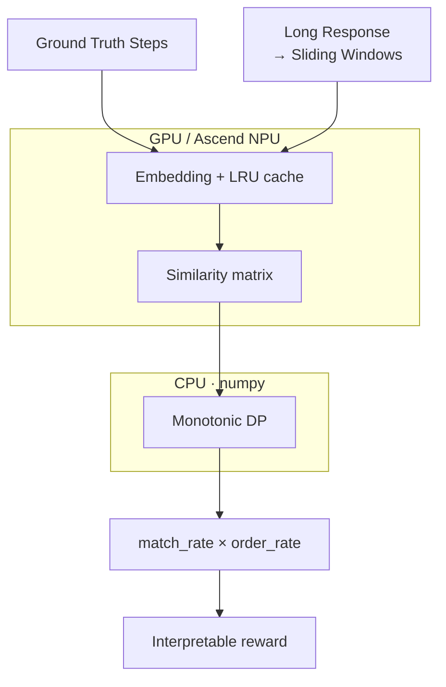

# ⚡ Reward Align Scorer

<p align="right">
  <a href="./README.md">English</a> |
  <a href="./README.zh-CN.md">中文</a>
</p>

Fast and interpretable semantic reward scoring for long-response RL training.

Reward Align Scorer converts slow, per-sample Judge-style step evaluation into a batched semantic alignment problem:

Compared with direct `LLM-as-Judge`, it is faster, lighter on memory, and easier to batch. Compared with pure rule matching, it is more semantic: it can handle paraphrases, partial step coverage, and ordered matching in long responses. During rollout, it can work as a lightweight reward pre-scorer to reduce reward-side waiting and pipeline bubbles.

Unlike final-answer sparse rewards, it produces **step-level dense semantic signals**: each reference step can be matched, missed, or diagnosed with an aligned response window.



Similarity matrix is computed as a **single batched GEMM** on GPU/NPU; the **monotonic DP runs on CPU (numpy)** to avoid per-cell host↔device sync — ~50× faster than running the DP loop on GPU. Sliding windows use a coarse→fine two-pass scheme with early-exit, and an LRU cache reuses embeddings across rollout workers.

It is designed for RLHF, RLAIF, GRPO, and agent post-training workloads where responses can be long, reward functions must run online, and calling an LLM Judge for every sample creates a training bottleneck.

## 🚧 Why This Exists

Modern RL post-training often optimizes long responses, tool traces, or multi-step reasoning. The trainer can generate rollouts quickly, but reward scoring may become the slow side of the pipeline:

| Reward method | Common issue |
| --- | --- |
| LLM-as-Judge | Accurate but slow and expensive for every rollout |
| String/rule matching | Fast but brittle to paraphrases |
| Sentence split + greedy match | Fragile on long responses and cascade errors |
| Reward Align Scorer | Batched embedding similarity + sliding windows + monotonic DP |

The goal is not to replace all Judge calls. A practical deployment uses this scorer for high-confidence structured checks and falls back to LLM Judge for ambiguous samples.

## ✨ Key Advantages

| Compared with | Advantage |
| --- | --- |
| LLM-as-Judge | Lower latency, lower memory footprint, easier batching for online rollout scoring |
| Pure rule matching | Handles paraphrases, local semantic coverage, and key segments in long responses |
| Sentence-level greedy matching | Uses sliding windows and monotonic DP to reduce cascade errors |
| Black-box reward scores | Returns matched/unmatched steps, alignment path, match rate, and order rate |

## 📊 Performance Reference

In an actual RL rollout setting with a **32B-parameter model**, `batch_size=32`, `rollout.n=8`, and `mean_response_length≈4096`, one step of reward compute finished within a sub-second range. This makes the scorer practical as an online reward pre-scorer during rollout, reducing reward-side waiting and pipeline bubbles in synchronous training.

> Latency depends on the embedding model, GPU/NPU hardware, window configuration, cache hit rate, and response length. Run `benchmarks/benchmark_latency.py` in your own training environment for calibration.

## 🧩 Features

- Normalized `0~1` score by default; task-specific reward functions can apply external weights.
- Step-level dense semantic reward signals instead of final-answer-only sparse rewards.
- Long-response scoring for `max_response_length=4096/8192` style training.
- Sliding-window semantic matching instead of hard sentence boundaries.
- Monotonic alignment DP to avoid greedy cascade errors.
- GPU / Ascend NPU / CPU device selection.
- LRU embedding cache for long-running reward workers.
- veRL-compatible `compute_score` entrypoint.
- Interpretable output: matched steps, unmatched steps, alignment path, match/order rates.

## 📦 Installation

```bash
pip install -e .
```

For development:

```bash
pip install -e ".[dev]"
pytest
```

## 🚀 Quick Start

```python
from reward_align_scorer import ScorerConfig, SemanticRewardScorer
from reward_align_scorer.embedding import load_embedding_backend

backend = load_embedding_backend("/path/to/your_embedding_model")
scorer = SemanticRewardScorer(backend, ScorerConfig(threshold=0.65))

result = scorer.score(
    response="I read the issue, inspected the relevant files, patched the implementation, ran tests, and summarized the fix.",
    reference_steps=[
        "read the issue",
        "inspect relevant files",
        "modify the implementation",
        "run tests",
        "summarize the fix",
    ],
)

print(result.score)
print(result.match_rate, result.order_rate)
print(result.matched_steps)
print(result.unmatched_steps)
```

`result.score` is normalized to `0~1` by default and combines coverage and order: `score = match_rate * order_rate * max_score`. If semantic alignment should be a dominant reward term, apply an external task weight, for example `final_reward += 3.0 * result.score`.

- `match_rate`: fraction of reference steps that found a matching response window.
- `order_rate`: among matched steps, the fraction of adjacent reference-step pairs whose best response windows appear in the expected order (`1.0` = fully ordered, `0.0` = fully reversed). This is computed from each matched step's strongest window, independent of the monotonic DP path, so it can detect scrambled responses even when `match_rate` is high.

## 🔌 veRL Integration

Copy or import `reward_align_scorer.verl_adapter.compute_score` as a reward function:

```python
from reward_align_scorer.verl_adapter import compute_score
```

Set the embedding model path:

```bash
export REWARD_ALIGN_MODEL_PATH=/path/to/bge-small-zh-v1.5
export REWARD_ALIGN_THRESHOLD=0.65
```

Example input:

```python
score = compute_score(
    solution_str="<think>...</think> long model response",
    ground_truth=None,
    extra_info={
        "reference_steps": [
            "read the issue",
            "inspect relevant files",
            "modify the implementation",
            "run tests",
            "summarize the fix",
        ]
    },
)
```

## 🎯 Suitable Scenarios

- Agent trajectory reward: expected actions vs. actual trace.
- Tool-use workflows: search, read, edit, test, report.
- Code repair process scoring.
- RAG answer evidence/checklist coverage.
- Long-form response quality checks with required reference points.
- SOP/checklist style structured reward.
- Two-stage reward systems that reduce LLM Judge calls.

Less suitable:

- Open-ended creative writing with no reference structure.
- Strict symbolic correctness, where a verifier is required.
- Pure subjective preference ranking.
- High-risk factual verification without structured evidence or Judge fallback.

## 🛠️ Project Status

This is an early-stage plugin scaffold. The core algorithm and veRL entrypoint are implemented; production users should calibrate thresholds with task-specific hard negatives and benchmark latency inside their actual rollout environment.
