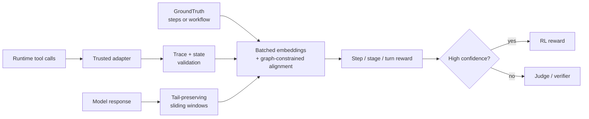
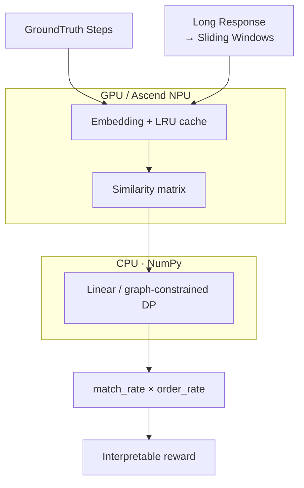

# RAISE

> **Reward-Aligned Interpretable Scoring Engine**
>
> Dense credit assignment for long-horizon agent trajectories.

<p align="right">
  <a href="./README.md">English</a> |
  <a href="./README.zh-CN.md">中文</a>
</p>

RAISE is a fast, interpretable reward pre-scorer for long-horizon Agentic RL.
It compares an actual response or trusted tool trace with structured
GroundTruth, then returns dense step-level credit instead of a single opaque
final-answer score.

It is designed for RLHF, RLAIF, GRPO, veRL, coding agents, browser agents, and
other workflows where reward must be computed online.



## 💡 Why RAISE

| Capability | LLM-as-Judge | String rules | RAISE |
| --- | --- | --- | --- |
| Step-level credit | Prompt-dependent | Binary | Matched/unmatched steps and stages |
| Paraphrase handling | Strong | Brittle | Embedding similarity |
| Order awareness | Prompt-dependent | Usually absent | Monotonic alignment + pairwise order |
| Long response support | Expensive | Fast | Bounded, tail-preserving windows |
| Runtime evidence | Prompt text | Custom rules | Trusted events + graph/state validation |
| Batching | Autoregressive | N/A | Cross-sample embedding batches |
| Ambiguous cases | Native | Weak | Confidence routing to Judge |

RAISE is not a universal Judge. It works best when expected behavior can be
represented as steps, a checklist, a DAG/state machine, or verifiable runtime
events.

## ⚡ Acceleration pipeline

The scoring hot path keeps dense tensor work on the accelerator and moves the
small dynamic-programming recurrence to CPU/NumPy:



`score_batch()` combines steps and response windows from active rollout
samples into shared encoder calls. Coarse-to-fine matching lets fully covered
samples skip the fine pass, while the LRU cache avoids re-encoding recurring
GroundTruth steps. The DP matrix is small, so executing it on CPU avoids the
per-cell host/device synchronization caused by a Python GPU loop.

## ✨ Features

- Linear reference-step scoring with semantic coverage and order reward.
- Candidate actions per step and best-of-many trajectory scoring.
- Cross-sample `score_batch()` with coarse-to-fine windows and LRU caching.
- Workflow GroundTruth with required/optional nodes and alternative,
  retry, recovery, and rollback edges.
- Graph-constrained alignment over bounded workflow states × response windows.
- Turn-level potential rewards, `r_t = gamma * Phi_t - Phi_(t-1)`, with
  turn-end token placement.
- Action/Evidence/Outcome contracts, stage rewards, and environment-state
  checks.
- Trusted `TraceEvent` validation with bounded visits and transitions.
- Tool-call adapters for shell/pytest, files, browser, HTTP, and custom tools.
- Optional anti-recitation trace gate.
- Confidence routing and Judge fallback signals.
- Hugging Face model IDs, local models, configurable pooling, asymmetric
  query/passage instructions, and multilingual E5 presets.
- veRL-compatible `compute_score`.

## Installation

```bash
pip install -e .
```

Development:

```bash
pip install -e ".[dev]"
python -m pytest
```

Python 3.9+ is supported.

## 🚀 Quick start

Configure the embedding backend for the veRL reward worker:

```bash
export RAISE_MODEL_PATH=intfloat/multilingual-e5-small
export RAISE_THRESHOLD=0.80
```

References belong to the standard nested RLVR Parquet field
`reward_model.ground_truth`; they are not constructed at the reward call site.
The `row` below represents one sample after veRL reads the Parquet dataset:

```python
from raise_scorer.integrations import compute_score

row = {
    "data_source": "repo-repair",
    "prompt": [
        {
            "role": "user",
            "content": "Fix the parser failure and verify the change.",
        }
    ],
    "ability": "agentic_repo_repair",
    "reward_model": {
        "style": "rule",
        "ground_truth": {
            "reference_steps": [
                "inspect parser source",
                "implement boundary guard",
                "execute parser regression suite",
                "report verified test outcome",
            ]
        },
    },
    "extra_info": {
        "task_id": "repair-001",
        "split": "train",
    },
}

details = compute_score(
    data_source=row["data_source"],
    solution_str=(
        "Inspect parser source and isolate the faulty branch with repository "
        "evidence. Implement boundary guard in the identified condition and "
        "emit a focused diff. Execute parser regression suite and retain "
        "successful command output. Report verified test outcome with the "
        "changed behavior and validation scope."
    ),
    ground_truth=row["reward_model"]["ground_truth"],
    extra_info=row["extra_info"],
    return_details=True,
)

print(details["semantic_score"])
print(details["score"])
print(details["reference_steps_source"])  # ground_truth.reference_steps
print(details["step_match_rate"], details["step_order_rate"])
print(details["matched_steps"])
print(details["unmatched_steps"])
```

This matches the veRL RewardManager call:
`ground_truth=reward_model.ground_truth`, `extra_info=extra_info`.
`details["semantic_score"]` is normalized to `0..1` by default:

```text
score = match_rate × order_rate × max_score
```

The final `details["score"]` also includes the repetition penalty. Apply
external weights in the training configuration when composing it with outcome
reward.

## 🧭 Scoring modes

The following sections demonstrate lower-level Python APIs. In veRL/RLVR
training, prefer the `compute_score()` and nested Parquet GroundTruth flow
above.

```python
from raise_scorer.backends import load_embedding_backend
from raise_scorer.core import ScorerConfig, SemanticRewardScorer

backend = load_embedding_backend("intfloat/multilingual-e5-small")
if backend is None:
    raise RuntimeError("Embedding backend could not be loaded")
scorer = SemanticRewardScorer(backend, ScorerConfig(threshold=0.80))
```

### 1. Linear steps and rollout batches

A step may contain alternative actions. Any matching candidate credits that
step:

```python
result = scorer.score(
    response="I searched the web, opened the knowledge base, and cited evidence.",
    reference_steps=[
        "search for sources",
        ["open a web source", "open the knowledge base"],
        "answer with a citation",
    ],
)
```

Use `score_batch()` in rollout workers:

```python
results = scorer.score_batch(
    responses=[
        "I inspected the module, patched it, and ran tests.",
        "I reproduced the bug, added a workaround, and verified it.",
    ],
    reference_steps_batch=[
        ["inspect files", "modify code", "run tests"],
        ["reproduce bug", "add workaround", "verify the fix"],
    ],
)
rewards = [item.score for item in results]
```

The coarse and fine passes combine active samples into shared embedding calls.
Similarity matrices and alignment results remain sample-specific.

### 2. Explicit alternative trajectories

Use this for a small number of known valid branches:

```python
from raise_scorer.core import score_trajectories

result = score_trajectories(
    scorer,
    response="I reproduced the issue, added a workaround, and ran tests.",
    trajectories=[
        ["reproduce bug", "patch code", "run tests"],
        ["reproduce bug", "add workaround", "run tests"],
    ],
)

print(result.best_index)
print(result.score)
```

### 3. Workflow GroundTruth

Use a bounded DAG/state machine when trajectories branch, retry, or roll back:

```python
from raise_scorer.workflows import WorkflowGroundTruth, WorkflowScorer

workflow = WorkflowGroundTruth.from_dict({
    "start": "inspect",
    "terminals": ["done"],
    "nodes": [
        {"id": "inspect", "stage": "diagnosis", "action": "inspect failing code"},
        {
            "id": "patch",
            "stage": "repair",
            "action": ["patch code", "apply workaround"],
            "max_visits": 2,
            "postconditions": {"repo": {"modified": True}},
        },
        {"id": "test", "stage": "verification", "action": "run tests", "max_visits": 2},
        {"id": "failed", "action": "tests still fail"},
        {"id": "done", "action": "tests pass", "outcome": "summarize the fix"},
    ],
    "edges": [
        {"from": "inspect", "to": "patch"},
        {"from": "patch", "to": "test", "max_traversals": 2},
        {"from": "test", "to": "done"},
        {"from": "test", "to": "failed"},
        {"from": "failed", "to": "patch", "kind": "retry"},
    ],
})

result = WorkflowScorer(scorer).score(response, workflow)
print(result.best_path)
print(result.stage_rewards)
print(result.graph_states, result.graph_transitions)
```

The default `alignment_mode="graph"` finitely unrolls bounded cycles, searches
the workflow-state × response-window product directly, and runs full
Action/Evidence/Outcome and state scoring only on the selected path. The old
complete-path scorer remains available through
`WorkflowScorerConfig(alignment_mode="enumerate")` as an ablation baseline.
`max_graph_states`, `max_path_nodes`, and `max_expansions` bound worker cost.

See [the workflow example](examples/workflow_ground_truth.py) and
[design notes](docs/design.md#workflow-groundtruth-v1).

### 4. Turn-level potential reward

`WorkflowPotentialScorer` evaluates workflow-prefix progress after every agent
turn:

```python
from raise_scorer.workflows import PotentialRewardConfig, WorkflowPotentialScorer

potential_scorer = WorkflowPotentialScorer(
    WorkflowScorer(scorer),
    PotentialRewardConfig(gamma=1.0),
)
turn_result = potential_scorer.score_turns(
    ["inspect failure", "patch code", "run tests", "summarize fix"],
    workflow,
)

print(turn_result.potentials)
print(turn_result.rewards)  # gamma * Phi_t - Phi_(t-1)
```

The default potential is required-node coverage. Agent turns are preserved as
explicit passages, so two turns cannot collapse into one character window.
Use `raise_scorer.experiments.assign_turn_rewards()` to place each increment on
the final completion token of its agent turn.

### 5. Trusted runtime events

Runtime evidence is stronger than model-written claims. Normalize framework
tool calls into `TraceEvent` objects:

```python
from raise_scorer.runtime import RuntimeEventAdapter
from raise_scorer.workflows import WorkflowScorer

# Construct this inside trusted rollout infrastructure.
adapter = RuntimeEventAdapter(trusted_runtime=True)
events = adapter.adapt_many([
    {
        "id": "inspect-1",
        "tool": "read_file",
        "arguments": {"path": "src/parser.py"},
        "node_id": "inspect",
    },
    {
        "id": "verify-1",
        "tool": "exec_command",
        "arguments": {"cmd": "python -m pytest tests/test_parser.py -q"},
        "output": {"stdout": "12 passed"},
        "exit_code": 0,
        "node_id": "done",
    },
])

result = WorkflowScorer(scorer).score_events(events, workflow)
print(result.trace_validation.to_dict())
```

The adapter supports shell/pytest, file read/write, browser, HTTP, namespaced
tool names, and generic tools. Custom semantics can be registered with
`EventSemantics`; `node_resolver` can map runtime records to workflow nodes.

Trust is controlled only by the adapter instance. A tool payload cannot
self-promote through `trusted=true` or `source=runtime`. Sensitive mapping keys
such as tokens, passwords, cookies, and API keys are recursively redacted by
default.

See [the runtime adapter example](examples/runtime_adapters.py).

## Embedding backends

`load_embedding_backend()` accepts a local model directory or Hugging Face
model ID:

```python
backend = load_embedding_backend(
    "intfloat/multilingual-e5-small",
    pooling="mean",
    query_instruction="query: ",
    passage_instruction="passage: ",
    revision="<commit-sha>",
    local_files_only=False,
)
```

RAISE encodes reference steps as queries and response windows as passages.
Built-in multilingual E5 presets select mean pooling and the required
`query: `/`passage: ` prefixes automatically. Explicit options override a
preset.

For production:

- pin an exact model revision;
- download models before starting offline workers;
- calibrate thresholds on task-specific rollout data;
- monitor `coverage_rate`, `tail_covered`, margins, and fallback rate.

## Confidence routing

```python
from raise_scorer.core import assess_confidence, classify_steps

print(classify_steps(reference_steps))
report = assess_confidence(result, reference_steps, response=response)

if report.fallback_recommended:
    reward = llm_judge_or_verifier(response)
else:
    reward = result.score
```

The router considers coverage, order, similarity margins, proxy-step ratio,
trace evidence, and intention-only recitation. The optional hard trace gate is
enabled with `ScorerConfig(require_trace=True)`.

## veRL integration

The canonical entrypoint is:

```python
from raise_scorer.integrations import compute_score
```

It accepts the current named custom-reward interface:

```python
compute_score(
    data_source=...,
    solution_str=...,
    ground_truth=...,
    extra_info=...,
)
```

Configure the embedding backend:

```bash
export RAISE_MODEL_PATH=intfloat/multilingual-e5-small
export RAISE_THRESHOLD=0.80
export RAISE_MODEL_REVISION="<commit-sha>"
export RAISE_LOCAL_FILES_ONLY=0
```

Supported `extra_info` fields:

| Field | Purpose |
| --- | --- |
| `reference_steps` / `actions` | Linear GroundTruth |
| `workflow_ground_truth` | DAG/state-machine GroundTruth |
| `workflow_config` | Workflow scoring weights and gates |
| `state_observations` | External before/after state |
| `trace_events` | Pre-built runtime events |
| `trace_validation_config` | Trace validation policy |
| `tool_calls` | Runtime records to adapt |
| `tool_adapter_config` | Runtime trust and redaction policy |

### RLVR Parquet GroundTruth

veRL reads the Parquet row, then passes only
`reward_model.ground_truth` and `extra_info` to a custom reward function.
RAISE therefore supports both recommended layouts:

```python
# Layout A: structured reward_model.ground_truth
row = {
    "reward_model": {
        "style": "rule",
        "ground_truth": {
            "reference_steps": [
                "inspect repository",
                ["patch code", "apply workaround"],
                "run tests",
            ]
        },
    },
    "extra_info": {"task_id": "repair-001"},
}

# Layout B: keep a final-answer target and put process steps in extra_info
row = {
    "reward_model": {
        "style": "rule",
        "ground_truth": "expected final answer",
    },
    "extra_info": {
        "task_id": "repair-002",
        "reference_steps": ["inspect repository", "patch code", "run tests"],
    },
}
```

Native Arrow lists/structs and JSON-serialized lists/objects are accepted.
Plain scalar `ground_truth` strings are not interpreted as process steps, so a
math answer such as `"42"` cannot accidentally become a reference step.

Known nested paths include `metadata.reference_steps`,
`rlvr.reference_steps`, and their `actions` aliases. A custom reward wrapper
can pass `reference_steps_paths=["task.annotation.plan"]` for another schema.
`return_details=True` reports the selected field as
`reference_steps_source`.

If `reference_steps` is a top-level Parquet column, move it into
`extra_info` during dataset preprocessing; the standard veRL RewardManager
does not forward arbitrary top-level columns to `compute_score`.

See [the RLVR Parquet schema example](examples/rlvr_parquet_schema.py).

The included wrapper is
[`integrations/verl/utils/reward_score/semantic_align.py`](integrations/verl/utils/reward_score/semantic_align.py).

## 📊 Benchmarks

Latency:

```bash
python benchmarks/benchmark_latency.py \
  --model-path intfloat/multilingual-e5-small \
  --batch-size 32 \
  --breakdown
```

Reward quality and routing:

```bash
python benchmarks/reward_quality.py \
  --model-path intfloat/multilingual-e5-small \
  --threshold 0.80
```

Per-sample audit:

```bash
python benchmarks/dump_scores.py \
  --model-path intfloat/multilingual-e5-small \
  --require-trace
```

Graph alignment versus terminal-path enumeration:

```bash
python benchmarks/benchmark_graph_alignment.py \
  --model-path intfloat/multilingual-e5-small \
  --branches 2 \
  --layers 5
```

The small monotonic DP runs on CPU/NumPy while embedding GEMMs run on the
selected accelerator. This avoids per-cell host/device synchronization.
Benchmark your own hardware and rollout distribution before choosing limits.

## 🧪 Three-domain online RL experiment

The checked-in protocol defines
`3 domains × 4 reward ablations × 3 seeds = 36 runs`:

- Code: SWE-Gym training and SWE-bench Verified evaluation.
- Browser: BrowserGym/WebArena training and WebArena Verified evaluation.
- Tool use: executable BFCL multi-turn training and BFCL V4 agentic evaluation.
- Rewards: `outcome_only`, `linear_terminal`, `graph_terminal`, and
  `graph_turn_potential`.

See the [online RL protocol](experiments/online_rl/README.md) for the matrix
and required metrics. The Python protocol layer validates the suite, places
turn rewards on tokens, and aggregates episodes by domain/ablation/seed.
Environments only emit the existing trusted `TraceEvent` contract.

## Package structure

```text
raise_scorer/
├── backends/       model loading, pooling, encoding, cache
├── core/           windows, alignment, scoring, confidence, trajectories
├── workflows/      DAG/state-machine schema and hierarchical reward
├── experiments/    online-RL protocols and turn-to-token reward placement
├── runtime/        TraceEvent protocol, validation, tool-call adapters
├── integrations/   training-framework entrypoints
└── *.py            backward-compatible flat import shims
```

Recommended imports:

```python
from raise_scorer.backends import load_embedding_backend
from raise_scorer.core import SemanticRewardScorer
from raise_scorer.runtime import RuntimeEventAdapter, TraceEvent
from raise_scorer.workflows import WorkflowGroundTruth, WorkflowScorer
from raise_scorer.integrations import compute_score
```

Existing flat imports such as `raise_scorer.scorer` and
`raise_scorer.verl_adapter` remain compatible.

## 📚 Documentation and examples

| Resource | Contents |
| --- | --- |
| [Design](docs/design.md) | Algorithms, trust boundary, reward design, calibration |
| [Basic usage](examples/basic_usage.py) | Linear scoring |
| [Workflow example](examples/workflow_ground_truth.py) | Retry and state verification |
| [Runtime adapter example](examples/runtime_adapters.py) | Tool records to trusted events |
| [Judge fallback](examples/judge_fallback_demo.py) | Confidence routing |
| [veRL example](examples/verl_reward_fn.py) | Custom reward entrypoint |
| [RLVR Parquet schema](examples/rlvr_parquet_schema.py) | Recommended GroundTruth layouts |
| [Contributing](CONTRIBUTING.md) | Development and PR requirements |

## Project boundary

Recommended:

- coding and repository-repair trajectories;
- browser, search, and tool-use workflows;
- structured RAG/evidence coverage;
- SOP/checklist process reward;
- two-stage RAISE + Judge/verifier systems.

Use a dedicated verifier or Judge for strict program correctness, mathematical
equivalence, high-risk factual claims, open-ended creativity, and subjective
preference ranking.

## 🚧 Status

RAISE is alpha software. The core scorer, workflow engine, trusted runtime
protocol, veRL entrypoint, routing signals, and benchmarks are covered by
tests. Before production, add labeled rollout samples from your domain,
calibrate thresholds and graph limits, pin model/framework versions, and
monitor fallback and reward-hacking rates.

Contributions are welcome. See [CONTRIBUTING.md](CONTRIBUTING.md).
