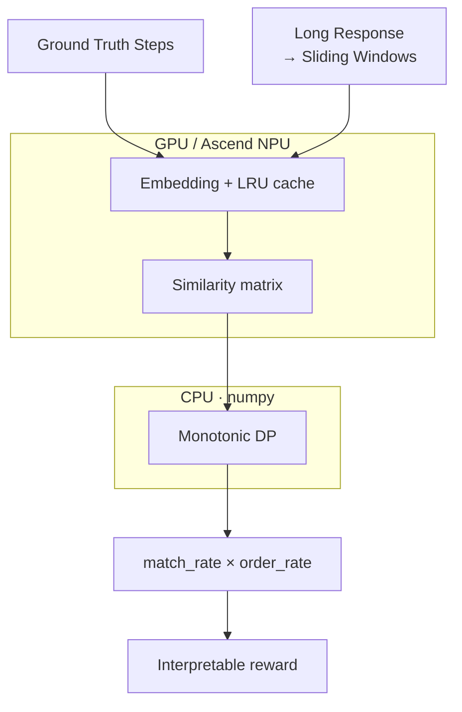
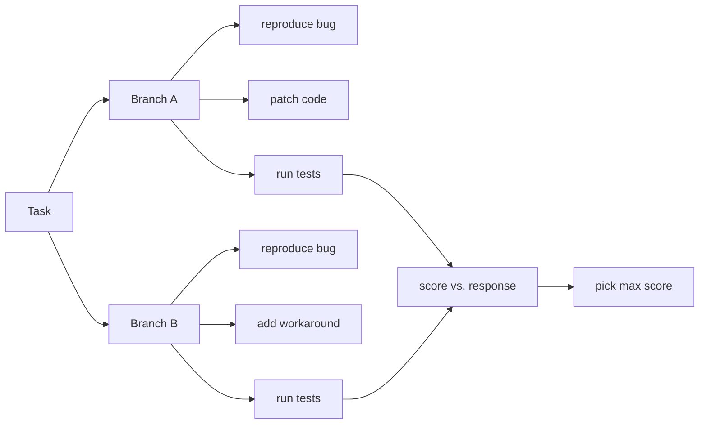

# ⚡ Reward Align Scorer

<p align="right">
  <a href="./README.md">English</a> |
  <a href="./README.zh-CN.md">中文</a>
</p>

**Dense, white-box semantic reward scoring for long-response RL training.** Reward Align Scorer turns slow, per-sample LLM-Judge step evaluation into a batched embedding-similarity + monotonic-alignment problem, and returns a step-level interpretable signal instead of one black-box score at the final answer.



Similarity matrix is computed as a **single batched GEMM** on GPU/NPU; the **monotonic DP runs on CPU (numpy)** to avoid per-cell host↔device sync — ~50× faster than running the DP loop on GPU. Sliding windows use a coarse→fine two-pass scheme with early-exit, and an LRU cache reuses embeddings across rollout workers.

## ✨ Advantages

**Dense, white-box reward.** Instead of one black-box score at the final answer, every reference step is reported as matched or unmatched with its aligned response window, plus `match_rate`, `order_rate`, and the full alignment path — so you can tell whether the model missed a step, did the right steps in the wrong order, or padded the response with repetition.

| | LLM-as-Judge | Rule / string matching | Final-answer sparse reward | **Reward Align Scorer** |
| --- | --- | --- | --- | --- |
| Granularity | per-sample verdict | binary match | one score at the end | step-level dense |
| Semantics | strong | brittle to paraphrases | none | embedding similarity |
| Order awareness | via prompt | fragile / greedy | none | monotonic DP + `order_rate` |
| Interpretability | reasoning text | hit/miss | black-box | matched/unmatched steps + path |
| Latency / sample | ~seconds (autoregressive) | fast | fast | ~ms (batched GEMM + CPU DP) |
| Batching | hard (per-sample calls) | n/a | n/a | one encoder forward + one GEMM |
| Cost | high | low | low | low (LRU cache → ~0 on repeats) |

Built for RLHF, RLAIF, GRPO, and agent post-training where responses are long and reward must run online. It does not replace every Judge call — use it for high-confidence structured samples and fall back to LLM Judge for ambiguous ones.

## ⚡ Why It's Fast

The bottleneck is not raw FLOPs — it's one autoregressive LLM-Judge call per sample, serialized across the rollout batch. Reward Align Scorer replaces that with a batched tensor pipeline:

| Stage | Replaces | Speedup mechanism |
| --- | --- | --- |
| Sliding windows | Whole-response encoding | Turns a variable-length 4096/8192 response into a bounded set of fixed-length chunks → batched encoding and a single GEMM become possible |
| Batched embedding + single GEMM | N×M Judge calls | One encoder forward over all steps + windows, then `sim = step_emb @ win_emb.T` — autoregressive decode replaced by dense matrix multiply (~2 orders of magnitude cheaper per sample) |
| Monotonic DP on CPU (numpy) | GPU per-cell DP loop | The DP matrix is small (`num_steps × num_windows`); running on CPU avoids per-cell host↔device sync — measured ~50× faster than the torch per-cell loop |
| LRU embedding cache | Re-encoding every sample | Reference steps reused across the rollout batch and across training steps; long-running workers approach zero encoding cost |
| Coarse→fine + early-exit | Always-fine matching | Fully-matched samples skip the fine pass entirely |
| Judge fallback routing | Scoring every sample with Judge | Only ambiguous samples hit the slow path; Judge calls drop by an order of magnitude |

End-to-end, per-sample reward moves from **~seconds (Judge) to ~milliseconds (scorer)**, so a whole rollout step's reward finishes in the sub-second range — eliminating the synchronous-training pipeline bubble.

> The ~50× DP figure is measured on the actual `monotonic_align` recurrence. Run `benchmarks/benchmark_latency.py --breakdown` in your own environment for end-to-end numbers.

## 📊 Performance Reference

In an actual RL rollout setting with a **32B-parameter model**, `batch_size=32`, `rollout.n=8`, and `mean_response_length≈4096`, one step of reward compute finished within a sub-second range.

> Latency depends on the embedding model, GPU/NPU hardware, window configuration, cache hit rate, and response length. Run `benchmarks/benchmark_latency.py --breakdown` in your own training environment for calibration.

## 🧩 Features

- Normalized `0~1` score; apply external task weights for reward shaping.
- Each reference step may carry **multiple candidate actions** — any one matching credits the step (for steps realizable by different tools or phrasings).
- **Multi-trajectory scoring** — pass several valid step sequences; the best-matching one wins. Handles branching agent plans.
- Coarse→fine sliding windows with early-exit; LRU embedding cache.
- GPU / Ascend NPU / CPU device selection.
- veRL-compatible `compute_score` entrypoint.
- Interpretable output: matched/unmatched steps, alignment path, match/order rates.
- **Recitation-hacking audit tool** — `benchmarks/dump_scores.py` checks whether high-scored responses genuinely executed the steps or just recited their names.

## 📦 Installation

```bash
pip install -e .
```

For development:

```bash
pip install -e ".[dev]"
pytest
```

## 🚀 Quick Start

```python
from reward_align_scorer import ScorerConfig, SemanticRewardScorer
from reward_align_scorer.embedding import load_embedding_backend

backend = load_embedding_backend("/path/to/your_embedding_model")
scorer = SemanticRewardScorer(backend, ScorerConfig(threshold=0.65))

result = scorer.score(
    response="I read the issue, inspected the relevant files, patched the implementation, ran tests, and summarized the fix.",
    reference_steps=[
        "read the issue",
        "inspect relevant files",
        "modify the implementation",
        "run tests",
        "summarize the fix",
    ],
)

print(result.score)
print(result.match_rate, result.order_rate)
print(result.matched_steps)
print(result.unmatched_steps)
```

`result.score` is normalized to `0~1` by default and combines coverage and order: `score = match_rate * order_rate * max_score`. If semantic alignment should be a dominant reward term, apply an external task weight, for example `final_reward += 3.0 * result.score`.

- `match_rate`: fraction of reference steps that found a matching response window.
- `order_rate`: among matched steps, the fraction of adjacent reference-step pairs whose best response windows appear in the expected order (`1.0` = fully ordered, `0.0` = fully reversed). This is computed from each matched step's strongest window, independent of the monotonic DP path, so it can detect scrambled responses even when `match_rate` is high.

A step may carry multiple candidate actions (any one matching credits the step):

```python
result = scorer.score(
    response="I searched the web, extracted the key evidence, and answered with a citation.",
    reference_steps=[
        "search for sources",
        ["open web source", "open knowledge base"],  # either tool counts
        "extract evidence",
        "answer with citation",
    ],
)
```

## Multi-Path Scoring (Branching Agent Plans)

When a task admits multiple valid action sequences (different branches), pass every trajectory — the scorer evaluates each, and the best-matching one wins. A step within a trajectory can still carry multiple candidate actions.



```python
from reward_align_scorer.trajectories import score_trajectories

result = score_trajectories(
    scorer,
    response="I reproduced the issue, added a workaround, and ran the tests.",
    trajectories=[
        ["reproduce bug", "patch code", "run tests"],         # branch A
        ["reproduce bug", "add workaround", "run tests"],     # branch B
    ],
)
print(result.best_index)   # → 1 (took branch B)
print(result.score)        # → branch B's score
print(result.result.matched_steps)
```

Win criterion is `(score, match_rate, order_rate)` descending — a fully matching trajectory beats one with marginal score advantage but worse coverage.

Cost: response windows encoded once and reused across trajectories via the LRU cache. Runtime scales with *distinct step strings*, not trajectories.

## 🔌 veRL Integration

Copy or import `reward_align_scorer.verl_adapter.compute_score` as a reward function:

```python
from reward_align_scorer.verl_adapter import compute_score
```

Set the embedding model path:

```bash
export REWARD_ALIGN_MODEL_PATH=/path/to/bge-small-zh-v1.5
export REWARD_ALIGN_THRESHOLD=0.65
```

Example input:

```python
score = compute_score(
    solution_str="<think>...</think> long model response",
    ground_truth=None,
    extra_info={
        "reference_steps": [
            "read the issue",
            "inspect relevant files",
            "modify the implementation",
            "run tests",
            "summarize the fix",
        ]
    },
)
```

`extra_info` accepts `reference_steps` (canonical) or `actions` (Agentic-RL alias). To drop the wrapper into a veRL source tree, copy `integrations/verl/utils/reward_score/semantic_align.py` to `verl/utils/reward_score/semantic_align.py` — it is a one-line re-export of `compute_score`.

## 🎯 Suitable Scenarios

- Agent trajectory reward: expected actions vs. actual trace.
- Tool-use workflows: search, read, edit, test, report.
- Code repair process scoring.
- RAG answer evidence/checklist coverage.
- Long-form response quality checks with required reference points.
- SOP/checklist style structured reward.
- Two-stage reward systems that reduce LLM Judge calls.

Less suitable:

- Open-ended creative writing with no reference structure.
- Strict symbolic correctness, where a verifier is required.
- Pure subjective preference ranking.
- High-risk factual verification without structured evidence or Judge fallback.

## 🛠️ Project Status

This is an early-stage plugin scaffold. The core algorithm and veRL entrypoint are implemented; production users should calibrate thresholds with task-specific hard negatives and benchmark latency inside their actual rollout environment.
