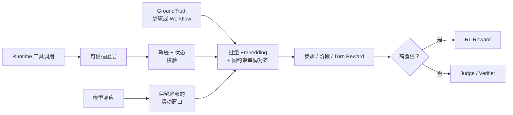
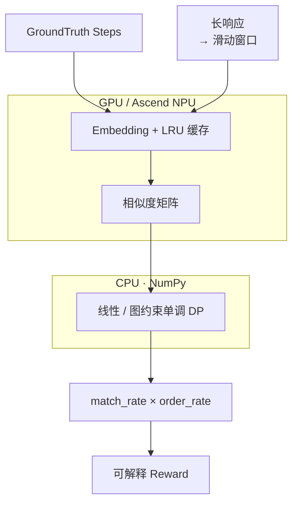

# RAISE

> **Reward-Aligned Interpretable Scoring Engine**
>
> 面向长程 Agent 轨迹的可解释密集奖励与信用分配引擎。

<p align="right">
  <a href="./README.md">English</a> |
  <a href="./README.zh-CN.md">中文</a>
</p>

RAISE 是面向长程 Agentic RL 的高效、可解释 Reward Pre-Scorer。它将实际
响应或可信工具轨迹与结构化 GroundTruth 对齐，输出步骤级密集信用，而不是只给
最终答案一个不透明分数。

它适用于 RLHF、RLAIF、GRPO、veRL、Coding Agent、Browser Agent，以及需要
在线计算 reward 的多步骤工具任务。



## 💡 为什么使用 RAISE

| 能力 | LLM-as-Judge | 字符串规则 | RAISE |
| --- | --- | --- | --- |
| 步骤级信用 | 依赖 Prompt | 二元命中 | matched/unmatched 步骤与阶段 |
| 改写鲁棒性 | 强 | 脆弱 | Embedding 语义相似度 |
| 顺序感知 | 依赖 Prompt | 通常没有 | 单调对齐 + pairwise order |
| 长响应支持 | 成本高 | 快 | 有界、保留尾部的窗口 |
| 运行时证据 | 模型文本 | 自定义规则 | 可信事件 + 图/状态校验 |
| 批处理 | 自回归生成 | 不适用 | 跨样本批量编码 |
| 模糊样本 | 原生处理 | 能力弱 | 置信度路由到 Judge |

RAISE 不是万能 Judge。它最适合能够将期望行为表示成步骤、checklist、
DAG/状态机或可验证运行时事件的任务。

## ⚡ 加速组件流程

评分热路径将稠密张量计算留在加速设备上，将规模较小的动态规划递推放到
CPU/NumPy：



`score_batch()` 会把活跃 rollout 样本的 reference steps 与 response windows
合并到共享 encoder 调用。粗到细匹配使完整覆盖的样本跳过细扫，LRU 缓存避免
重复编码高频 GroundTruth steps。DP 矩阵本身很小，因此放在 CPU 执行可以避免
Python GPU 循环产生的逐格 host/device 同步。

## ✨ 核心能力

- 线性 reference steps 语义覆盖与顺序评分。
- 单步替代 action 与多条候选轨迹评分。
- 跨样本 `score_batch()`、粗到细窗口和 LRU 缓存。
- Workflow GroundTruth：必选/可选节点，替代、重试、恢复、回滚边。
- Graph-Constrained Alignment：直接搜索有界状态图 × 响应窗口。
- turn-level 势函数 reward：`r_t = γΦ_t - Φ_(t-1)`，支持映射到 turn
  末 token。
- Action/Evidence/Outcome 契约、阶段 reward 与环境状态校验。
- 可信 `TraceEvent`、节点访问与图转移边界校验。
- shell/pytest、文件、浏览器、HTTP 和自定义工具适配器。
- 可选的复读欺诈 trace gate。
- 置信度路由与 Judge fallback 信号。
- Hugging Face 模型 ID、本地模型、可配置 pooling、query/passage
  instruction 与 multilingual E5 preset。
- veRL-compatible `compute_score`。

## 安装

```bash
pip install -e .
```

开发环境：

```bash
pip install -e ".[dev]"
python -m pytest
```

支持 Python 3.9+。

## 🚀 快速开始

先为 veRL Reward Worker 配置 Embedding Backend：

```bash
export RAISE_MODEL_PATH=intfloat/multilingual-e5-small
export RAISE_THRESHOLD=0.80
```

reference 不在 Reward Function 调用处临时定义，而是随 RLVR 数据写入 Parquet
行的标准嵌套字段 `reward_model.ground_truth`。下面的 `row` 表示 veRL 从
Parquet 读取后交给 RewardManager 的一条样本：

```python
from raise_scorer.integrations import compute_score

row = {
    "data_source": "repo-repair",
    "prompt": [
        {
            "role": "user",
            "content": "修复 parser 故障并验证修改。",
        }
    ],
    "ability": "agentic_repo_repair",
    "reward_model": {
        "style": "rule",
        "ground_truth": {
            "reference_steps": [
                "检查相关文件",
                "修改实现",
                "运行受影响测试",
                "总结已验证的修复",
            ]
        },
    },
    "extra_info": {
        "task_id": "repair-001",
        "split": "train",
    },
}

details = compute_score(
    data_source=row["data_source"],
    solution_str=(
        "首先，我检查了 src/parser.py 以及相关测试文件，确认故障来自 parser "
        "对边界输入的错误处理。随后，我修改 parser 的实现并补充必要的边界判断，"
        "确保原有调用保持兼容。完成实现修改后，我运行了受影响的 parser 单元测试"
        "和回归测试，所有测试均已通过。最后，我检查测试结果与代码差异，总结了"
        "已经验证的修复内容和验证范围。"
    ),
    ground_truth=row["reward_model"]["ground_truth"],
    extra_info=row["extra_info"],
    return_details=True,
)

print(details["semantic_score"])
print(details["score"])
print(details["reference_steps_source"])  # ground_truth.reference_steps
print(details["step_match_rate"], details["step_order_rate"])
print(details["matched_steps"])
print(details["unmatched_steps"])
```

veRL 的 RewardManager 正是以 `ground_truth=reward_model.ground_truth` 和
`extra_info=extra_info` 调用该入口。`details["semantic_score"]` 默认归一化到
`0..1`：

```text
score = match_rate × order_rate × max_score
```

最终 `details["score"]` 还会计入重复惩罚。与 outcome reward 组合时，建议在
训练配置层施加外部权重。

## 🧭 五种评分模式

以下部分展示底层 Python API；在 veRL/RLVR 训练中，优先使用上面的
`compute_score()` 和 Parquet 嵌套 GroundTruth。

```python
from raise_scorer.backends import load_embedding_backend
from raise_scorer.core import ScorerConfig, SemanticRewardScorer

backend = load_embedding_backend("intfloat/multilingual-e5-small")
if backend is None:
    raise RuntimeError("Embedding backend 加载失败")
scorer = SemanticRewardScorer(backend, ScorerConfig(threshold=0.80))
```

### 1. 线性步骤与 Rollout Batch

每个步骤可以包含多个替代 action，任一候选匹配即可获得该步信用：

```python
result = scorer.score(
    response="我搜索网页、打开知识库并引用证据作答。",
    reference_steps=[
        "搜索来源",
        ["打开网页来源", "打开知识库"],
        "带引用作答",
    ],
)
```

Rollout worker 中应优先使用 `score_batch()`：

```python
results = scorer.score_batch(
    responses=[
        "我检查模块、修改代码并运行测试。",
        "我复现故障、添加 workaround 并完成验证。",
    ],
    reference_steps_batch=[
        ["检查文件", "修改代码", "运行测试"],
        ["复现故障", "添加 workaround", "验证修复"],
    ],
)
rewards = [item.score for item in results]
```

粗扫和细扫会将活跃样本合并到共享 embedding 调用；相似度矩阵与对齐结果仍然
逐样本独立。

### 2. 显式候选轨迹

适合合法分支数量较少且已知的任务：

```python
from raise_scorer.core import score_trajectories

result = score_trajectories(
    scorer,
    response="我复现问题、添加 workaround 并运行测试。",
    trajectories=[
        ["复现问题", "修改代码", "运行测试"],
        ["复现问题", "添加 workaround", "运行测试"],
    ],
)

print(result.best_index)
print(result.score)
```

### 3. Workflow GroundTruth

当任务包含分支、重试或回滚时，使用有界 DAG/状态机：

```python
from raise_scorer.workflows import WorkflowGroundTruth, WorkflowScorer

workflow = WorkflowGroundTruth.from_dict({
    "start": "inspect",
    "terminals": ["done"],
    "nodes": [
        {"id": "inspect", "stage": "diagnosis", "action": "检查故障代码"},
        {
            "id": "patch",
            "stage": "repair",
            "action": ["修改代码", "应用 workaround"],
            "max_visits": 2,
            "postconditions": {"repo": {"modified": True}},
        },
        {"id": "test", "stage": "verification", "action": "运行测试", "max_visits": 2},
        {"id": "failed", "action": "测试仍然失败"},
        {"id": "done", "action": "测试通过", "outcome": "总结修复"},
    ],
    "edges": [
        {"from": "inspect", "to": "patch"},
        {"from": "patch", "to": "test", "max_traversals": 2},
        {"from": "test", "to": "done"},
        {"from": "test", "to": "failed"},
        {"from": "failed", "to": "patch", "kind": "retry"},
    ],
})

result = WorkflowScorer(scorer).score(response, workflow)
print(result.best_path)
print(result.stage_rewards)
print(result.graph_states, result.graph_transitions)
```

默认 `alignment_mode="graph"`：RAISE 先把有界循环展开为有限状态图，再在
“状态图 × 响应窗口”乘积空间中直接寻找合法单调路径，只对选中的路径执行完整
Action/Evidence/Outcome 与状态评分。旧的全路径枚举仍可通过
`WorkflowScorerConfig(alignment_mode="enumerate")` 使用，作为消融基线。
`max_graph_states`、`max_path_nodes`、`max_expansions` 用于限制 worker 成本。

完整示例见 [Workflow 示例](examples/workflow_ground_truth.py)，设计说明见
[Workflow GroundTruth v1](docs/design.zh-CN.md#workflow-groundtruth-v1)。

### 4. Turn-level Potential Reward

`WorkflowPotentialScorer` 在每个 Agent turn 后计算工作流前缀势函数与势差：

```python
from raise_scorer.workflows import (
    PotentialRewardConfig,
    WorkflowPotentialScorer,
)

potential_scorer = WorkflowPotentialScorer(
    WorkflowScorer(scorer),
    PotentialRewardConfig(gamma=1.0),
)
turn_result = potential_scorer.score_turns(
    ["检查故障", "修改代码", "运行测试", "总结修复"],
    workflow,
)

print(turn_result.potentials)
print(turn_result.rewards)  # γΦ_t - Φ_(t-1)
```

默认势函数使用必选节点覆盖率，并保留真实 turn 边界作为对齐窗口。在线 RL 中
可用 `raise_scorer.experiments.assign_turn_rewards()` 把每个增量放到对应
Agent turn 的最后一个 completion token。

### 5. 可信运行时事件

运行时证据比模型自述更可靠。可以把不同框架的工具调用转换为
`TraceEvent`：

```python
from raise_scorer.runtime import RuntimeEventAdapter
from raise_scorer.workflows import WorkflowScorer

# 只能在可信 rollout 基础设施中创建。
adapter = RuntimeEventAdapter(trusted_runtime=True)
events = adapter.adapt_many([
    {
        "id": "inspect-1",
        "tool": "read_file",
        "arguments": {"path": "src/parser.py"},
        "node_id": "inspect",
    },
    {
        "id": "verify-1",
        "tool": "exec_command",
        "arguments": {"cmd": "python -m pytest tests/test_parser.py -q"},
        "output": {"stdout": "12 passed"},
        "exit_code": 0,
        "node_id": "done",
    },
])

result = WorkflowScorer(scorer).score_events(events, workflow)
print(result.trace_validation.to_dict())
```

适配层支持 shell/pytest、文件读写、浏览器、HTTP、带命名空间的工具名和
通用工具；可用 `EventSemantics` 注册自定义语义，通过 `node_resolver` 映射
Workflow 节点。

trust 只由 adapter 实例控制。工具 payload 不能通过 `trusted=true` 或
`source=runtime` 自我升级。token、password、cookie、API key 等敏感 mapping
字段默认递归脱敏。

完整示例见 [Runtime Adapter 示例](examples/runtime_adapters.py)。

## Embedding Backend

`load_embedding_backend()` 接受本地模型目录或 Hugging Face 模型 ID：

```python
backend = load_embedding_backend(
    "intfloat/multilingual-e5-small",
    pooling="mean",
    query_instruction="query: ",
    passage_instruction="passage: ",
    revision="<commit-sha>",
    local_files_only=False,
)
```

RAISE 将 reference steps 编码为 query，将 response windows 编码为 passage。
内置 multilingual E5 preset 会自动选择 mean pooling 和所需的
`query: `/`passage: ` 前缀；显式参数优先于 preset。

生产环境建议：

- 固定精确模型 revision；
- 离线 worker 启动前下载模型；
- 使用真实任务 rollout 数据标定 threshold；
- 监控 `coverage_rate`、`tail_covered`、margin 和 fallback rate。

## 置信度路由

```python
from raise_scorer.core import assess_confidence, classify_steps

print(classify_steps(reference_steps))
report = assess_confidence(result, reference_steps, response=response)

if report.fallback_recommended:
    reward = llm_judge_or_verifier(response)
else:
    reward = result.score
```

路由器综合考虑覆盖率、顺序、相似度 margin、proxy step 比例、trace evidence
与意图式复读。使用 `ScorerConfig(require_trace=True)` 可以启用可选 hard
trace gate。

## veRL 集成

推荐入口：

```python
from raise_scorer.integrations import compute_score
```

兼容当前命名式自定义 reward 接口：

```python
compute_score(
    data_source=...,
    solution_str=...,
    ground_truth=...,
    extra_info=...,
)
```

配置 Embedding Backend：

```bash
export RAISE_MODEL_PATH=intfloat/multilingual-e5-small
export RAISE_THRESHOLD=0.80
export RAISE_MODEL_REVISION="<commit-sha>"
export RAISE_LOCAL_FILES_ONLY=0
```

支持的 `extra_info` 字段：

| 字段 | 用途 |
| --- | --- |
| `reference_steps` / `actions` | 线性 GroundTruth |
| `workflow_ground_truth` | DAG/状态机 GroundTruth |
| `workflow_config` | Workflow 权重和 gate |
| `state_observations` | 外部 before/after 状态 |
| `trace_events` | 已构造的运行时事件 |
| `trace_validation_config` | 轨迹校验策略 |
| `tool_calls` | 待适配的运行时记录 |
| `tool_adapter_config` | Runtime trust 与脱敏策略 |

### RLVR Parquet GroundTruth

veRL 读取 Parquet 行后，只会把 `reward_model.ground_truth` 和 `extra_info`
传给自定义 Reward Function。因此 RAISE 支持下面两种推荐布局：

```python
# 布局 A：结构化 reward_model.ground_truth
row = {
    "reward_model": {
        "style": "rule",
        "ground_truth": {
            "reference_steps": [
                "检查仓库",
                ["修改代码", "应用 workaround"],
                "运行测试",
            ]
        },
    },
    "extra_info": {"task_id": "repair-001"},
}

# 布局 B：保留最终答案 GroundTruth，把过程步骤放进 extra_info
row = {
    "reward_model": {
        "style": "rule",
        "ground_truth": "预期最终答案",
    },
    "extra_info": {
        "task_id": "repair-002",
        "reference_steps": ["检查仓库", "修改代码", "运行测试"],
    },
}
```

支持原生 Arrow list/struct，也支持 JSON 序列化的 list/object。普通标量
`ground_truth` 字符串不会被当成过程步骤，因此数学答案 `"42"` 不会意外变成
reference step。

内置识别 `metadata.reference_steps`、`rlvr.reference_steps` 及对应的
`actions` 别名。其他 schema 可以在自定义 Reward Wrapper 中传入
`reference_steps_paths=["task.annotation.plan"]`。使用
`return_details=True` 时，结果会通过 `reference_steps_source` 报告最终采用的
字段路径。

如果 `reference_steps` 是 Parquet 顶层列，需要在数据预处理阶段将它移动到
`extra_info`；标准 veRL RewardManager 不会把任意顶层列传给
`compute_score`。

完整示例见
[RLVR Parquet Schema 示例](examples/rlvr_parquet_schema.py)。

仓库内置 wrapper：
[`integrations/verl/utils/reward_score/semantic_align.py`](integrations/verl/utils/reward_score/semantic_align.py)。

## 📊 Benchmark

延迟：

```bash
python benchmarks/benchmark_latency.py \
  --model-path intfloat/multilingual-e5-small \
  --batch-size 32 \
  --breakdown
```

Reward 质量与路由：

```bash
python benchmarks/reward_quality.py \
  --model-path intfloat/multilingual-e5-small \
  --threshold 0.80
```

逐样本审计：

```bash
python benchmarks/dump_scores.py \
  --model-path intfloat/multilingual-e5-small \
  --require-trace
```

图约束对齐与终局路径枚举对比：

```bash
python benchmarks/benchmark_graph_alignment.py \
  --model-path intfloat/multilingual-e5-small \
  --branches 2 \
  --layers 5
```

小规模单调 DP 在 CPU/NumPy 上执行，Embedding GEMM 在选定加速设备上执行，
从而避免逐格 host/device 同步。配置限制前，应在自己的硬件和 rollout
分布上运行 Benchmark。

## 🧪 三领域在线 RL 实验

仓库固定了一套 `3 domains × 4 reward ablations × 3 seeds = 36 runs` 的协议：

- Code：SWE-Gym 训练，SWE-bench Verified 评估；
- Browser：BrowserGym/WebArena 训练，WebArena Verified 评估；
- Tool：可执行 BFCL 多轮任务训练，BFCL V4 agentic 评估；
- 消融：`outcome_only`、`linear_terminal`、`graph_terminal`、
  `graph_turn_potential`。

配置与必报指标见
[三领域在线 RL 协议](experiments/online_rl/README.md)。Python 层提供 suite
校验、turn-to-token reward 放置，以及按 domain/ablation/seed 的 episode
指标聚合；环境只需输出已有的可信 `TraceEvent`。

## 代码结构

```text
raise_scorer/
├── backends/       模型加载、pooling、编码与缓存
├── core/           窗口、对齐、评分、置信度与候选轨迹
├── workflows/      DAG/状态机 schema 与分层 reward
├── experiments/    在线 RL 协议与 turn-to-token reward
├── runtime/        TraceEvent、校验与工具调用适配
├── integrations/   训练框架入口
└── *.py            兼容旧版扁平导入路径的 shim
```

推荐导入方式：

```python
from raise_scorer.backends import load_embedding_backend
from raise_scorer.core import SemanticRewardScorer
from raise_scorer.runtime import RuntimeEventAdapter, TraceEvent
from raise_scorer.workflows import WorkflowGroundTruth, WorkflowScorer
from raise_scorer.integrations import compute_score
```

已有的 `raise_scorer.scorer`、`raise_scorer.verl_adapter` 等扁平导入路径仍然
兼容。

## 📚 文档与示例

| 资源 | 内容 |
| --- | --- |
| [设计文档](docs/design.zh-CN.md) | 算法、信任边界、Reward 设计与标定 |
| [基础示例](examples/basic_usage.py) | 线性步骤评分 |
| [Workflow 示例](examples/workflow_ground_truth.py) | 重试与状态校验 |
| [Runtime Adapter 示例](examples/runtime_adapters.py) | 工具记录转换为可信事件 |
| [Judge Fallback](examples/judge_fallback_demo.py) | 置信度路由 |
| [veRL 示例](examples/verl_reward_fn.py) | 自定义 Reward 入口 |
| [RLVR Parquet Schema](examples/rlvr_parquet_schema.py) | 推荐的 GroundTruth 布局 |
| [三领域在线 RL 协议](experiments/online_rl/README.md) | 36-run 实验矩阵、消融与报告要求 |
| [贡献指南](CONTRIBUTING.md) | 开发与 PR 要求 |

## 项目边界

推荐场景：

- Coding Agent 和仓库修复轨迹；
- 浏览器、搜索和工具调用 Workflow；
- 结构化 RAG/Evidence 覆盖；
- SOP/checklist 过程 Reward；
- RAISE + Judge/Verifier 两阶段系统。

对于严格代码正确性、数学等价性、高风险事实、开放式创作和主观偏好排序，应
使用专用 verifier 或 Judge。

## 🚧 项目状态

RAISE 当前处于 Alpha 阶段。核心 scorer、Workflow Engine、可信 Runtime
协议、veRL 入口、路由信号和 Benchmark 已有测试覆盖。用于生产前，请加入
领域真实 rollout 标注，标定 threshold 与图限制，固定模型/框架版本，并监控
fallback 和 reward hacking 比例。

欢迎贡献，详见 [CONTRIBUTING.md](CONTRIBUTING.md)。
