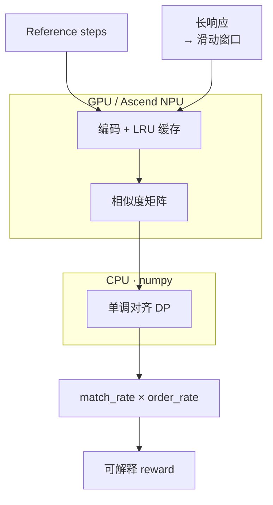

# ⚡ Reward Align Scorer

<p align="right">
  <a href="./README.md">English</a> |
  <a href="./README.zh-CN.md">中文</a>
</p>

面向 **长响应 RL 后训练** 的可解释语义 Reward Scorer。  
它把慢速、逐条、难批处理的 `LLM-as-Judge` / 规则式步骤评估，转化为 **embedding 矩阵检索 + 滑动窗口语义对齐 + 单调 DP** 问题，用于缓解 RLHF / RLAIF / GRPO 训练中的 reward 侧瓶颈。

相比直接使用 `LLM-as-Judge`，它响应更快、显存和计算占用更低；相比纯规则匹配，它能识别语义改写、局部步骤覆盖和顺序关系。在 rollout 阶段，它可以作为轻量级 reward pre-scorer，显著减少 reward 侧等待造成的 pipeline bubble。

不同于只在最终答案上打分的稀疏 reward，它提供 **步骤级稠密语义奖励信号**：每个 reference step 都可以被匹配、漏检，或定位到对应的 response window。



相似度矩阵在 **GPU/NPU 上以单次批量 GEMM** 计算；**单调 DP 跑在 CPU (numpy)** 上以规避逐格 host↔device 同步 —— 比在 GPU 上跑 DP 循环快约 50×。滑动窗口采用粗→细两段并支持提前退出，LRU 缓存在多个 rollout worker 间复用编码。

## 🚧 解决什么痛点

在后训练里，policy rollout 之后必须立刻打 reward。随着 `max_response_length=4096/8192` 变得常见，reward function 很容易成为训练慢点：

- **LLM Judge 太慢**：每条 rollout 都调用 Judge，推理延迟高，成本高，容易让训练主流程等待。
- **规则匹配太脆**：字符串包含判断无法处理改写、同义表达和长回答里的局部语义。
- **句子切分不可靠**：长回答中关键语义可能跨越标点边界，按句切分会漏召回。
- **贪心顺序匹配会级联错误**：前一个 reference step 匹配到错误位置后，后续步骤被迫从错误位置继续找。
- **Reward 不可解释**：只返回一个分数，很难判断模型是漏步骤、顺序错、重复灌水，还是 reward 规则误判。

Reward Align Scorer 的目标不是替代所有 Judge，而是作为一个 **低延迟、高可解释的前置 reward scorer**：高置信结构化样本直接打分，低置信或边界样本再 fallback 到 LLM Judge。

## ✨ 核心优势

| 对比对象 | Reward Align Scorer 的优势 |
| --- | --- |
| LLM-as-Judge | 更低延迟、更低显存占用、更容易批处理，适合 rollout 阶段在线打分 |
| 纯规则匹配 | 不依赖完全字符串命中，能处理同义改写、局部语义覆盖和长回答中的关键片段 |
| 句子级贪心匹配 | 用滑动窗口保留跨句语义，用单调 DP 搜索全局顺序路径，减少级联错配 |
| 黑盒 reward 分数 | 输出 matched/unmatched steps、alignment path、match/order rate，方便定位 reward 问题 |

## 📊 性能参考

在实际 RL rollout 场景中，基于 **32B 参数模型**，使用 `batch_size=32`、`rollout.n=8`、`mean_response_length≈4096` 的配置，一个 step 的 reward compute 可以在零点几秒内完成。这个结果说明该 scorer 适合作为 rollout 阶段的在线 reward pre-scorer，用于降低同步训练中 reward 侧等待造成的 pipeline bubble。

> 具体延迟会随 embedding 模型、GPU/NPU 型号、窗口参数、缓存命中率和 response 长度变化。建议在自己的训练环境中运行 `benchmarks/benchmark_latency.py` 做标定。

## 🧠 核心方案

| 模块 | 作用 | 解决的问题 |
| --- | --- | --- |
| Sliding Windows | 把长回答切成重叠语义窗口 | 避免句子硬切分导致的信息断裂 |
| Embedding Matrix Search | `steps_emb @ windows_emb.T` 批量计算相似度 | 把逐条判断变成 GPU/NPU 友好的矩阵计算 |
| Monotonic Alignment DP | 在相似度矩阵上找顺序一致的全局路径 | 避免贪心匹配 cascade error |
| LRU Cache | 缓存模型、文本 embedding 和热点 reference | 降低重复 rollout / 高频 prompt 的 reward 开销 |
| Diagnostics | 输出 matched/unmatched steps、alignment path、match/order rate | 让 reward 可调试、可解释、可做数据诊断 |

## 🎯 适配场景

它适合 **有参考结构** 的后训练任务：你能把期望行为表示成 reference steps、checklist、trajectory 或 evidence points。

### 1. Agent 轨迹 Reward

评估 Agent 是否完成了预期流程：

```text
read task -> inspect files -> edit code -> run tests -> summarize result
```

适用于 coding agent、repo repair、debugging agent、数据分析 agent、浏览器/工具调用 agent。

### 2. 工具调用和多步骤任务

模型输出或 tool trace 很长，但 reward 只关心关键动作是否覆盖、顺序是否合理：

```text
search -> open source -> extract evidence -> answer with citation
```

### 3. RAG / 长答案 Evidence 覆盖

把必须覆盖的证据点、事实点、约束条件作为 checklist，评估回答是否提到关键依据，而不是只看整段语义平均。

### 4. 代码修复过程评分

不只评估最终答案，还评估模型是否经历了关键工程动作：

```text
定位问题 -> 修改实现 -> 运行测试 -> 解释修复
```

这类 reward 对训练 coding agent 很有价值。

### 5. 长响应结构化质量控制

当 response 长达 4096/8192 tokens 时，整段 embedding 容易稀释关键点；滑动窗口能在局部窗口里定位关键语义。

### 6. 两阶段 Judge 系统

高置信样本用本 scorer 快速打分；低置信样本、低 margin 样本、unmatched steps 过多的样本再交给 LLM Judge。这样可以降低 Judge 调用频率，同时保留复杂样本上的判断能力。

## ⚠️ 不适合的场景

- 没有 reference steps / checklist / trajectory 的开放式创作。
- 纯主观偏好排序，比如“哪个回答更优雅”。
- 需要严格符号验证的任务，比如代码功能正确性、数学等价证明。
- 高风险事实核验且没有结构化 evidence 或 Judge fallback。

## 🧩 特性

- 默认输出归一化到 `0~1`，业务侧可通过外部权重组合到最终 reward。
- 提供步骤级稠密语义奖励信号，而不是只给 final-answer sparse reward。
- 支持 `max_response_length=4096/8192` 等长响应训练场景。
- 滑动窗口语义匹配替代硬句子边界。
- Monotonic Alignment DP 替代局部贪心匹配。
- 支持 GPU / Ascend NPU / CPU 设备选择。
- LRU embedding cache 支持长时间运行的 reward worker。
- veRL-compatible `compute_score` 入口，可放入 `verl/utils/reward_score`。
- 输出 `matched_steps`、`unmatched_steps`、`alignment_path`、`match_rate`、`order_rate`。

## 📦 安装

```bash
pip install -e .
```

开发环境：

```bash
pip install -e ".[dev]"
pytest
```

## 🚀 快速开始

```python
from reward_align_scorer import ScorerConfig, SemanticRewardScorer
from reward_align_scorer.embedding import load_embedding_backend

backend = load_embedding_backend("/path/to/bge-small-zh-v1.5")
scorer = SemanticRewardScorer(backend, ScorerConfig(threshold=0.65))

result = scorer.score(
    response="I read the issue, inspected the relevant files, patched the implementation, ran tests, and summarized the fix.",
    reference_steps=[
        "read the issue",
        "inspect relevant files",
        "modify the implementation",
        "run tests",
        "summarize the fix",
    ],
)

print(result.score)
print(result.match_rate, result.order_rate)
print(result.matched_steps)
print(result.unmatched_steps)
```

默认 `result.score` 是 `0~1` 的归一化语义对齐分数，综合覆盖与顺序：`score = match_rate * order_rate * max_score`。如果希望它作为主 reward 项，可以在业务 reward function 中乘以外部权重，例如 `final_reward += 3.0 * result.score`。

- `match_rate`：reference steps 中找到匹配响应窗口的比例。
- `order_rate`：在已匹配的 steps 中，相邻 reference step 对其最佳响应窗口按预期顺序出现的比例（`1.0` = 完全有序，`0.0` = 完全逆序）。该指标基于每个匹配 step 的最强窗口计算，独立于单调 DP 路径，因此即使 `match_rate` 很高也能识别出响应顺序被打乱的情况。

## 🔌 veRL 集成

可以直接导入 `reward_align_scorer.verl_adapter.compute_score` 作为 reward function：

```python
from reward_align_scorer.verl_adapter import compute_score
```

设置 embedding 模型路径：

```bash
export REWARD_ALIGN_MODEL_PATH=/path/to/your_embedding_model
export REWARD_ALIGN_THRESHOLD=0.65
```

示例输入：

```python
score = compute_score(
    solution_str="<think>...</think> long model response",
    ground_truth=None,
    extra_info={
        "reference_steps": [
            "read the issue",
            "inspect relevant files",
            "modify the implementation",
            "run tests",
            "summarize the fix",
        ]
    },
)
```

也可以把 wrapper 放到 veRL 源码树：

```text
verl/utils/reward_score/semantic_align.py
```

仓库中已提供示例：

```text
integrations/verl/utils/reward_score/semantic_align.py
```

## 🧭 项目边界

这个项目更像 **Reward Pre-Scorer / Reward Router**，不是万能 Judge。推荐生产用法：

```text
high confidence structured sample -> Reward Align Scorer
low confidence / ambiguous sample -> LLM Judge fallback
symbolic correctness task          -> verifier / unit tests
```

## 🛠️ 项目状态

当前是早期开源插件骨架。核心算法、veRL 入口、示例、测试和 benchmark 脚本已经提供；生产使用前建议基于具体任务构造 hard negatives 校准阈值，并在真实 rollout 环境中统计 latency、cache hit rate、fallback ratio 和 reward 分布。
