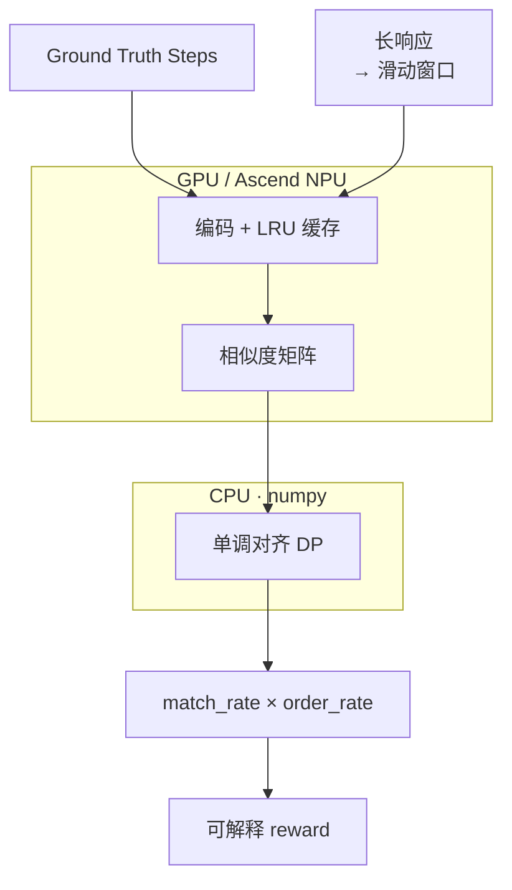
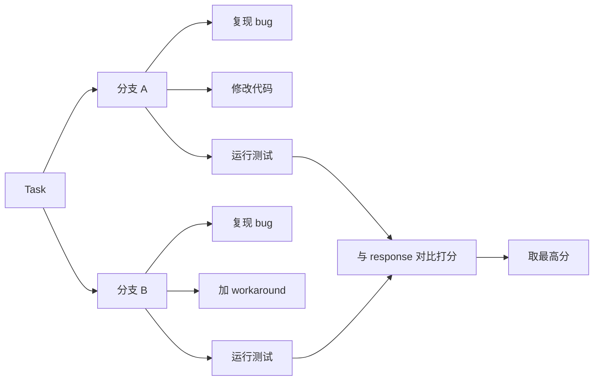

# ⚡ Reward Align Scorer

<p align="right">
  <a href="./README.md">English</a> |
  <a href="./README.zh-CN.md">中文</a>
</p>

**面向长响应 RL 后训练的密集白盒语义 Reward Scorer。** 它把慢速、逐条、难批处理的 `LLM-as-Judge` / 规则式步骤评估，转化为 **embedding 矩阵检索 + 滑动窗口语义对齐 + 单调 DP** 问题，返回步骤级可解释信号，而不是只在最终答案上给一个黑盒分数。



相似度矩阵在 **GPU/NPU 上以单次批量 GEMM** 计算；**单调 DP 跑在 CPU (numpy)** 上以规避逐格 host↔device 同步 —— 比在 GPU 上跑 DP 循环快约 50×。滑动窗口采用粗→细两段并支持提前退出，LRU 缓存在多个 rollout worker 间复用编码。

## ✨ 优势

**密集白盒 reward。** 不再只在最终答案上给一个黑盒分数，而是每个 reference step 都报出 matched/unmatched 及其对应的 response window，外加 `match_rate`、`order_rate` 和完整 alignment path —— 可以直接看出模型是漏步骤、顺序错、还是重复灌水。

| | LLM-as-Judge | 规则 / 字符串匹配 | 最终答案稀疏 reward | **Reward Align Scorer** |
| --- | --- | --- | --- | --- |
| 粒度 | 每样本一个判定 | 二元命中 | 末尾一个分数 | 步骤级密集 |
| 语义 | 强 | 改写即失效 | 无 | embedding 相似度 |
| 顺序感知 | 靠 prompt 引导 | 脆弱 / 贪心 | 无 | 单调 DP + `order_rate` |
| 可解释性 | reasoning 文本 | 命中/未命中 | 黑盒 | matched/unmatched steps + path |
| 单样本延迟 | ~秒级（自回归） | 快 | 快 | ~毫秒（批量 GEMM + CPU DP） |
| 批处理 | 难（逐样本调用） | 不适用 | 不适用 | 一次编码 + 一次 GEMM |
| 成本 | 高 | 低 | 低 | 低（LRU 缓存命中后趋近 0） |

面向 RLHF / RLAIF / GRPO / agent 后训练，响应长且 reward 必须在线运行。它不替代所有 Judge 调用 —— 高置信结构化样本用它直接打分，模糊样本 fallback 到 LLM Judge。

## ⚡ 为什么这么快

瓶颈不是算力，而是**每条样本一次自回归 LLM-Judge 调用**，在整个 rollout batch 上串行。Reward Align Scorer 把它换成一条批量张量流水线：

| 阶段 | 替代了什么 | 加速机制 |
| --- | --- | --- |
| 滑动窗口 | 整段响应编码 | 把变长的 4096/8192 响应切成有界的定长块 → 批量编码和单次 GEMM 才成为可能 |
| 批量编码 + 单次 GEMM | N×M 次 Judge 调用 | 对所有 steps + windows 做一次编码器前向，再 `sim = step_emb @ win_emb.T` —— 自回归解码被稠密矩阵乘替换，单样本成本约低 2 个数量级 |
| 单调 DP 跑在 CPU (numpy) | GPU 逐格 DP 循环 | DP 矩阵很小（`num_steps × num_windows`），在 CPU 上跑规避逐格 host↔device 同步 —— 实测比 torch 逐格循环快约 50× |
| LRU embedding 缓存 | 每个样本重新编码 | reference steps 在整个 rollout batch 和训练 step 间复用；长跑 worker 的编码成本趋近于零 |
| 粗→细 + 提前退出 | 永远跑细扫 | 全匹配样本直接跳过细扫 |
| Judge fallback 路由 | 每个样本都走 Judge | 只有模糊样本走慢路径，Judge 调用数降一个数量级 |

端到端看，单样本 reward 从 **~秒级 (Judge) 降到 ~毫秒级 (scorer)**，整个 rollout step 的 reward 在亚秒级完成 —— 消除同步训练的 pipeline bubble。

> ~50× DP 提速是在真实 `monotonic_align` 递推上实测的。端到端数字请在你自己的环境里跑 `benchmarks/benchmark_latency.py --breakdown`。

## 📊 性能参考

在实际 RL rollout 场景中，基于 **32B 参数模型**，使用 `batch_size=32`、`rollout.n=8`、`mean_response_length≈4096` 的配置，一个 step 的 reward compute 可以在零点几秒内完成。

> 具体延迟会随 embedding 模型、GPU/NPU 型号、窗口参数、缓存命中率和 response 长度变化。建议在自己的训练环境中运行 `benchmarks/benchmark_latency.py --breakdown` 做标定。

## 🎯 适配场景

它适合 **有参考结构** 的后训练任务：你能把期望行为表示成 reference steps、checklist、trajectory 或 evidence points。

### 1. Agent 轨迹 Reward

评估 Agent 是否完成了预期流程：

```text
read task -> inspect files -> edit code -> run tests -> summarize result
```

适用于 coding agent、repo repair、debugging agent、数据分析 agent、浏览器/工具调用 agent。

### 2. 工具调用和多步骤任务

模型输出或 tool trace 很长，但 reward 只关心关键动作是否覆盖、顺序是否合理：

```text
search -> open source -> extract evidence -> answer with citation
```

### 3. RAG / 长答案 Evidence 覆盖

把必须覆盖的证据点、事实点、约束条件作为 checklist，评估回答是否提到关键依据，而不是只看整段语义平均。

### 4. 代码修复过程评分

不只评估最终答案，还评估模型是否经历了关键工程动作：

```text
定位问题 -> 修改实现 -> 运行测试 -> 解释修复
```

这类 reward 对训练 coding agent 很有价值。

### 5. 长响应结构化质量控制

当 response 长达 4096/8192 tokens 时，整段 embedding 容易稀释关键点；滑动窗口能在局部窗口里定位关键语义。

### 6. 两阶段 Judge 系统

高置信样本用本 scorer 快速打分；低置信样本、低 margin 样本、unmatched steps 过多的样本再交给 LLM Judge。这样可以降低 Judge 调用频率，同时保留复杂样本上的判断能力。

## ⚠️ 不适合的场景

- 没有 reference steps / checklist / trajectory 的开放式创作。
- 纯主观偏好排序，比如“哪个回答更优雅”。
- 需要严格符号验证的任务，比如代码功能正确性、数学等价证明。
- 高风险事实核验且没有结构化 evidence 或 Judge fallback。

## 🧩 特性

- 默认输出归一化到 `0~1`，业务侧可通过外部权重组合到最终 reward。
- 每个 reference step 可携带**多个候选 action** —— 任一候选匹配即算该步通过（适用于同一步可用不同工具或措辞完成的场景）。
- **多轨迹打分** —— 支持传入多条合法 step 序列，取最佳匹配路径作为 reward。适用于有分支选择的 agent 任务。
- 支持 `max_response_length=4096/8192` 等长响应训练场景。
- 支持 GPU / Ascend NPU / CPU 设备选择。
- veRL-compatible `compute_score` 入口，可放入 `verl/utils/reward_score`。
- **复读欺诈防御（可选 trace gate）** —— 开启 `ScorerConfig(require_trace=True)`（或在 veRL adapter 中设 `REWARD_ALIGN_REQUIRE_TRACE=1`），对全文既无工具/执行痕迹（工具标签、git diff 标记、代码、文件路径、测试结论）也无推理/分析痕迹（因果连接词、动词锚定的 `root cause is` 类短语）的响应直接判 0 分。杀死懒散/填充式复读，且在真实 PR-fix 数据上对 genuine 零召回损失（详见 [docs/design.zh-CN.md](docs/design.zh-CN.md#复读防御p0可选)）。
- **复读欺诈审计工具** —— `benchmarks/dump_scores.py --require-trace` 输出 `denied` 列与 `[recall watch]` 行，量化 gate 误杀了多少真实步骤，便于在真实 rollout 数据上标定 pattern。
- **置信度路由 + Judge fallback** —— `assess_confidence()` 与 `compute_score(..., return_details=True)` 内置 `fallback_recommended`，将模糊样本路由到 LLM-as-Judge；见 [Step 设计指南](docs/design.zh-CN.md#reference-step-设计指南)。
- **Reward 质量 benchmark** —— `benchmarks/reward_quality.py` 统计 genuine vs recitation 的 score/confidence/fallback 率。

## 📦 安装

```bash
pip install -e .
```

开发环境：

```bash
pip install -e ".[dev]"
pytest
```

## 🚀 快速开始

```python
from reward_align_scorer import ScorerConfig, SemanticRewardScorer
from reward_align_scorer.embedding import load_embedding_backend

backend = load_embedding_backend("/path/to/bge-small-zh-v1.5")
scorer = SemanticRewardScorer(backend, ScorerConfig(threshold=0.65))

result = scorer.score(
    response="I read the issue, inspected the relevant files, patched the implementation, ran tests, and summarized the fix.",
    reference_steps=[
        "read the issue",
        "inspect relevant files",
        "modify the implementation",
        "run tests",
        "summarize the fix",
    ],
)

print(result.score)
print(result.match_rate, result.order_rate)
print(result.matched_steps)
print(result.unmatched_steps)
```

默认 `result.score` 是 `0~1` 的归一化语义对齐分数，综合覆盖与顺序：`score = match_rate * order_rate * max_score`。如果希望它作为主 reward 项，可以在业务 reward function 中乘以外部权重，例如 `final_reward += 3.0 * result.score`。

- `match_rate`：reference steps 中找到匹配响应窗口的比例。
- `order_rate`：在已匹配的 steps 中，相邻 reference step 对其最佳响应窗口按预期顺序出现的比例（`1.0` = 完全有序，`0.0` = 完全逆序）。该指标基于每个匹配 step 的最强窗口计算，独立于单调 DP 路径，因此即使 `match_rate` 很高也能识别出响应顺序被打乱的情况。

一个 step 也可以携带多个候选 action（任一匹配即算该步通过）：

```python
result = scorer.score(
    response="我先在网上搜索，提取了关键证据，然后带引用作答。",
    reference_steps=[
        "搜索来源",
        ["打开网页来源", "打开知识库来源"],  # 两种工具都算这一步通过
        "提取证据",
        "带引用作答",
    ],
)
```

## 多路径打分（分支 Agent 轨迹）

当同一个任务有多个合法步骤序列（不同分支）时，传入所有可能的轨迹：scorer 逐一打分，最佳匹配者胜出。轨迹内部的 step 仍可携带多个候选 action。



```python
from reward_align_scorer.trajectories import score_trajectories

result = score_trajectories(
    scorer,
    response="I reproduced the issue, added a workaround, and ran the tests.",
    trajectories=[
        ["reproduce bug", "patch code", "run tests"],         # 分支 A
        ["reproduce bug", "add workaround", "run tests"],     # 分支 B
    ],
)
print(result.best_index)   # → 1（走了分支 B）
print(result.score)        # → 分支 B 的 reward 分数
print(result.result.matched_steps)
```

胜出判定按 `(score, match_rate, order_rate)` 降序排列 —— 全匹配的轨迹比分数略高但覆盖不全的轨迹优先。

成本：response 窗口只需编码一次，跨轨迹复用（依赖 embedder 的 LRU 缓存）。运行时开销随**不同 step 字符串数**增长，不随轨迹数增长。

## 置信度路由（Judge Fallback）

语义 reward 快，但不是所有样本都该盲信。使用内置路由器：

```python
from reward_align_scorer import assess_confidence, classify_steps
from reward_align_scorer.verl_adapter import compute_score

print(classify_steps([
    "summarize the reported bug symptoms",  # reasoning — 较好
    "read the linked issue",                # proxy — 弱信号
    "run pytest on affected tests",         # observable — 强信号
]))

details = compute_score(solution_str, extra_info={"reference_steps": steps}, return_details=True)
if details["fallback_recommended"]:
    reward = llm_judge(solution_str, rubric)
else:
    reward = details["score"]
```

运行 `python benchmarks/reward_quality.py --model-path ...` 在你的数据上测量 fallback 率。

详见 [Reference Step 设计指南](docs/design.zh-CN.md#reference-step-设计指南)。

## 🔌 veRL 集成

可以直接导入 `reward_align_scorer.verl_adapter.compute_score` 作为 reward function：

```python
from reward_align_scorer.verl_adapter import compute_score
```

设置 embedding 模型路径：

```bash
export REWARD_ALIGN_MODEL_PATH=/path/to/your_embedding_model
export REWARD_ALIGN_THRESHOLD=0.65
```

示例输入：

```python
score = compute_score(
    solution_str="<think>...</think> long model response",
    ground_truth=None,
    extra_info={
        "reference_steps": [
            "read the issue",
            "inspect relevant files",
            "modify the implementation",
            "run tests",
            "summarize the fix",
        ]
    },
)
```

也可以把 wrapper 放到 veRL 源码树：

```text
verl/utils/reward_score/semantic_align.py
```

仓库中已提供示例：

```text
integrations/verl/utils/reward_score/semantic_align.py
```

`extra_info` 接受 `reference_steps`（主键）或 `actions`（Agentic-RL 别名）。要把 wrapper 放进 veRL 源码树，把 `integrations/verl/utils/reward_score/semantic_align.py` 拷到 `verl/utils/reward_score/semantic_align.py` —— 它是 `compute_score` 的一行 re-export。

## 🧭 项目边界

这个项目更像 **Reward Pre-Scorer / Reward Router**，不是万能 Judge。推荐生产用法：

```text
high confidence structured sample -> Reward Align Scorer
low confidence / ambiguous sample -> LLM Judge fallback
symbolic correctness task          -> verifier / unit tests
```

## 🛠️ 项目状态

Alpha 阶段插件：核心算法、veRL 入口、置信度路由、step 设计指南、标定 benchmark 已具备。上生产前建议：

1. 用 `classify_steps()` 审计 reference steps，尽量减少 proxy step。
2. 在任务 hard negatives 上标定 `threshold` 与 `RoutingConfig`。
3. 在真实 rollout 环境运行 `benchmarks/reward_quality.py` 与 `benchmarks/benchmark_latency.py`。
4. 监控 `fallback_recommended` 率 —— genuine 应低 fallback，ambiguous/recitation 应高 fallback。
